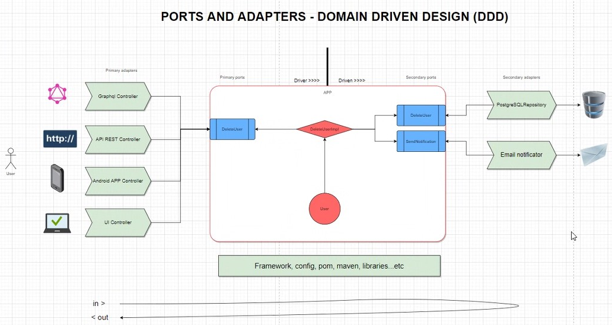

# Java Inditex Test

#### URL: http://localhost:8080/swagger-ui/index.html - Basic Auth (inditexCode/inditexCode)


This project has been developed following a hexagonal architecture to
solve the exposed test. In addition, throughout development there have
also been applied the clean code principle.

## Hexagonal Architecture
Also known as Ports and Adapters architecture, it is an architecture
that allows us to abstract the core of our application isolating it
from external technologies. The packages structure is the following:
- Infrastructure. Contains the adapters used by this application (external technologies).
- Application. Contains the ports that are used by the adapters.
- Domain. Contains the core of application.

In the following diagram, you can see the structure of this architecture.



## Requirements

For building and running the application you need:

- [JDK 1.11](https://www.oracle.com/es/java/technologies/javase/jdk11-archive-downloads.html)
- [Maven 3.8.6](https://maven.apache.org)

With these requirements you can build this project by:
```shell
mvn clean install
```

## Running the application locally

#### Url aplicacion: http://localhost:8080/swagger-ui/index.html - Basic Auth (inditexCode/inditexCode)

There are several ways to run a Spring Boot application on your local machine. One way is to execute the `main` method in the `com.inditex.InditexServiceApplication` class from your IDE.

Alternatively you can use the [Spring Boot Maven plugin](https://docs.spring.io/spring-boot/docs/current/reference/html/build-tool-plugins-maven-plugin.html) like so:

```shell
mvn spring-boot:run
```

## Architecture tests

The tests are located on:

```text
src.test.java.com.inditex.*
```
To execute this tests

## Test strategy

The tests develop were doing unit tests for each class of the project.

Do integration test on the controller.